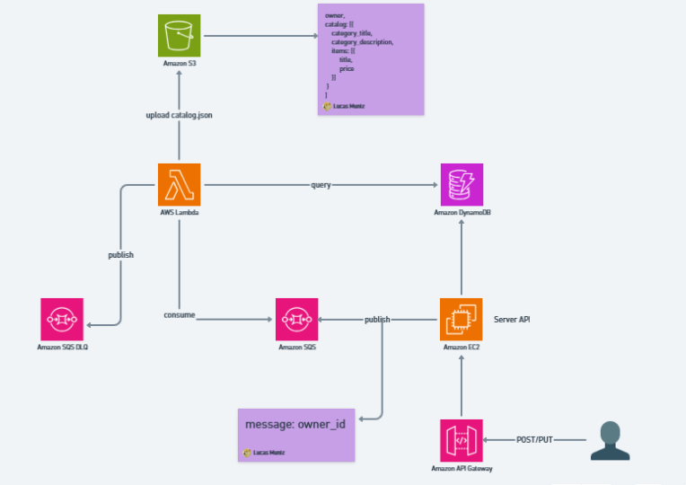

# Spring Boot REST API com DynamoDB, SQS e S3 no LocalStack (AWS)

Este repositório contém uma aplicação Spring Boot que expõe uma REST API para operações CRUD de Produtos e Categorias, utilizando o DynamoDB para armazenamento e o SQS para comunicação assíncrona. Uma função Lambda em Python consome as mensagens da fila, gera um arquivo JSON estruturado e o salva em um bucket S3.




## Estrutura das Entidades

**Produto**:

- `title`: Título do produto.
- `owner_id`: Identificador do dono do produto.
- `category`: Categoria do produto.
- `price`: Preço do produto.
- `description`: Descrição do produto.

**Categoria**:

- `title`: Título da categoria.
- `owner_id`: Identificador do dono da categoria.
- `description`: Descrição da categoria.

## Fluxo da Aplicação

1. A API Spring Boot expõe endpoints para criar, ler, atualizar e deletar produtos e categorias.
2. A cada operação de CRUD, uma mensagem é enviada para uma fila SQS, contendo o `owner_id`.
3. Uma função Lambda em Python escuta a fila SQS.
4. Ao receber uma mensagem, a Lambda:
   - Busca no DynamoDB todos os produtos e categorias do `owner_id`.
   - Cria um bucket S3 (se ainda não existir) com o nome baseado no `owner_id`.
   - Gera e salva um arquivo JSON com a estrutura:

```json
{
  "owner_id": "12345",
  "catalog": [
    {
      "category_title": "Categoria 1",
      "category_description": "Descrição da Categoria 1",
      "items": [
        { "title": "Produto A", "price": 100 },
        { "title": "Produto B", "price": 200 }
      ]
    }
  ]
}
```

5. Caso ocorra um erro, a mensagem é enviada para a fila DLQ (Dead Letter Queue).
6. Uma segunda função Lambda escuta a DLQ, analisa o erro e tenta reenviar a mensagem para a fila principal, respeitando um limite de tentativas.

## Como rodar o projeto com LocalStack

### Requisitos

- Docker
- Docker Compose
- Java 17+
- Python 3.8+

### Subindo o LocalStack

1. Crie um arquivo `docker-compose.yml` com o seguinte conteúdo:

```yaml
version: "3.8"

services:
  localstack:
    image: localstack/localstack:latest
    ports:
      - "4566:4566"
    environment:
      - SERVICES=sqs,dynamodb,s3
      - DEBUG=1
      - DATA_DIR=/tmp/localstack/data
      - LAMBDA_EXECUTOR=docker
    volumes:
      - "/var/run/docker.sock:/var/run/docker.sock"
      - "./localstack:/etc/localstack/init/ready.d"
```

2. Suba o LocalStack:

```bash
docker-compose up -d
```

3. Crie as filas SQS, tabelas DynamoDB e buckets S3 via AWS CLI ou com scripts de inicialização.

### Rodando a API Spring Boot localmente

1. Clone o repositório:

```bash
git clone <repo-url>
cd <repo-folder>
```

2. Configure as credenciais e endpoints locais do LocalStack no `application.yml` ou `application.properties`:

```yaml
aws:
  endpoint: http://localhost:4566
  region: us-east-1
  accessKey: test
  secretKey: test
```

3. Compile o projeto:

```bash
./mvnw clean install
```

4. Rode a aplicação:

```bash
./mvnw spring-boot:run
```

### Configurando a Função Lambda em Python

1. Crie o handler da Lambda principal (`lambda_function.py`):

```python
import boto3
import json
import os

dynamodb = boto3.resource('dynamodb', endpoint_url='http://localhost:4566')
s3 = boto3.client('s3', endpoint_url='http://localhost:4566')

SQS_QUEUE_URL = os.getenv('SQS_QUEUE_URL')
DLQ_QUEUE_URL = os.getenv('DLQ_QUEUE_URL')

def lambda_handler(event, context):
    for record in event['Records']:
        try:
            owner_id = record['body']

            # Busca produtos e categorias no DynamoDB
            products_table = dynamodb.Table('Products')
            categories_table = dynamodb.Table('Categories')

            products = products_table.query(KeyConditionExpression=boto3.dynamodb.conditions.Key('owner_id').eq(owner_id))['Items']
            categories = categories_table.query(KeyConditionExpression=boto3.dynamodb.conditions.Key('owner_id').eq(owner_id))['Items']

            catalog = []
            for category in categories:
                items = [p for p in products if p['category'] == category['title']]
                catalog.append({
                    "category_title": category['title'],
                    "category_description": category['description'],
                    "items": [{"title": p['title'], "price": p['price']} for p in items]
                })

            # Cria bucket e salva arquivo JSON
            bucket_name = f"owner-{owner_id}-catalog"
            try:
                s3.create_bucket(Bucket=bucket_name)
            except s3.exceptions.BucketAlreadyOwnedByYou:
                pass

            s3.put_object(
                Bucket=bucket_name,
                Key='catalog.json',
                Body=json.dumps({"owner_id": owner_id, "catalog": catalog}),
                ContentType='application/json'
            )

        except Exception as e:
            print(f"Error processing message: {e}")
            boto3.client('sqs', endpoint_url='http://localhost:4566').send_message(
                QueueUrl=DLQ_QUEUE_URL,
                MessageBody=record['body']
            )
```

2. Empacote a Lambda e suba para o LocalStack.

## Testando a Aplicação

1. Crie produtos e categorias via endpoints REST.
2. Verifique as mensagens na fila SQS.
3. Veja o arquivo JSON sendo criado no bucket S3.
4. Em caso de erro, a mensagem deve estar na fila DLQ e ser reprocessada.

## Contribuição

Sinta-se à vontade para abrir issues ou enviar pull requests!

Lembrete: Fiz esse projeto utilizando LocalStack, então, utilizei comandos AWS CLI para a criação dos recursos, mas em breve vou tentar implementar com terraform
